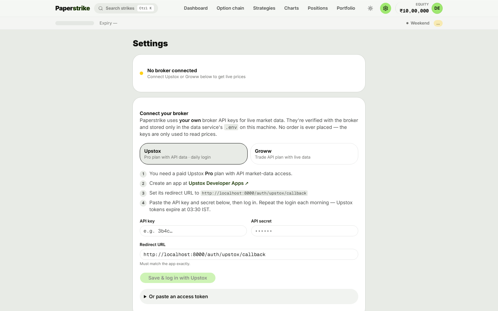
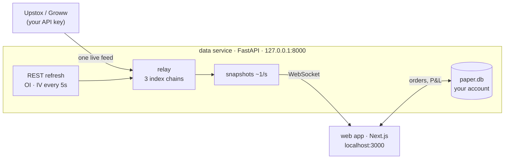

<div align="center">

# 📈 Paperstrike

### Practice NSE options with real market data and zero real money.

Trade the **live** NIFTY, BANK NIFTY and SENSEX option chains with a virtual account.<br>
Bring your own **Upstox** or **Groww** API key. Everything runs on your own machine.

[](LICENSE)
[](https://nodejs.org)
[](https://www.python.org)
[](#-bring-your-own-key)
[](https://github.com/rajmaurya0904/paperstrike/stargazers)

**[Quick start](#-quick-start) · [Features](#-features) · [Connect a broker](#-bring-your-own-key) · [How it works](#-how-it-works) · [FAQ](#-faq)**



</div>

---

## ⚡ Quick start

You need [Node.js 20+](https://nodejs.org) and [Python 3.10+](https://www.python.org/downloads/).
Then run one command:

```bash
npx github:rajmaurya0904/paperstrike
```

That's it. The first run installs everything and builds the app, which takes a
few minutes. After that it starts in seconds. Your browser opens at
**<http://localhost:3000>**. Go to **Settings → Connect your broker**, paste your keys
and start trading.

<details>
<summary><b>Launcher options</b></summary>

```bash
npx github:rajmaurya0904/paperstrike --no-open      # don't open the browser
npx github:rajmaurya0904/paperstrike --port 3001    # use another web port (data service: --api-port)
npx github:rajmaurya0904/paperstrike --reinstall    # rebuild from scratch (keys and account are kept)
```

Your keys and your paper account live in `~/.paperstrike/state`.
</details>

<details>
<summary><b>Docker</b></summary>

```bash
git clone https://github.com/rajmaurya0904/paperstrike.git
cd paperstrike
docker compose up --build
```

Open <http://localhost:3000>. Keys and account data are kept in the `paperstrike-state` volume.
</details>

<details>
<summary><b>Manual / development setup</b></summary>

```bash
git clone https://github.com/rajmaurya0904/paperstrike.git && cd paperstrike

# terminal 1: data service
cd data
python -m venv .venv
.venv/bin/pip install -r requirements.txt           # Windows: .venv\Scripts\pip
.venv/bin/python -m uvicorn server:app --host 127.0.0.1 --port 8000

# terminal 2: web app
cd web
npm install
npm run dev
```
</details>

---

## ✨ Features

| | |
|---|---|
| 🔗 **Live option chain** | CE/PE on either side of every strike, with OI and OI change, IV, delta and bid/ask. The ATM strike is highlighted, and you can view ±10, ±20 or all strikes. |
| 📊 **Charts** | 1m, 5m, 15m and 1D candles for the index or any option, with an OI-buildup overlay (long buildup, short covering and so on). Drag your SL and target straight on the chart. |
| 🧾 **Realistic orders** | Market and limit orders, stop-loss, target and **trailing stop** brackets, live P&L, one-click square-off, and a scalp mode with one-tap orders. |
| 🧩 **19 strategies** | Straddles, strangles, spreads, iron condors, butterflies and more, with payoff charts and breakevens. Deploy one in a click. |
| ⏱️ **Breakout plans** | Arm a 9:16, 9:20 or opening-range breakout plan. It fires once and won't chase a range that has already broken. |
| 💸 **Real costs** | Brokerage, STT, exchange and SEBI fees, GST and stamp duty at FY 2026-27 rates. Writing options blocks SPAN plus exposure margin, like a real broker. |
| 📈 **Portfolio analytics** | Equity curve, win rate, average win and loss, and max drawdown. |
| 🛡️ **Honest data** | If the feed is down you see "No data available". The app never shows a made-up price. |
| 🕘 **Market-hours rules** | Orders are accepted only from 09:15 to 15:30 IST, Monday to Friday. Intraday positions are squared off at the close. |

---

## 🔑 Bring your own key

Paperstrike doesn't have its own data feed. It uses **your** broker account's API,
so you get real, exchange-grade prices under your own broker's terms.

> **Both brokers charge for API market data.** Paperstrike itself is free, but you need an
> active paid API/data plan with Upstox or Groww. Check current pricing with your broker.

| | **Upstox** | **Groww** |
|---|---|---|
| Cost | Paid **Upstox Pro** plan with API market-data access | Paid Trade API plan **that includes live data** (the free trial doesn't) |
| Daily login | Yes. Tokens expire at 03:30 IST, and **Log in with Upstox** is one click | **No** with TOTP keys, because Paperstrike renews the token itself |
| Where to get keys | [Upstox developer apps](https://account.upstox.com/developer/apps) | [Groww Trade API](https://groww.in/trade-api) → API keys |

<details>
<summary><b>Upstox: step by step</b></summary>

1. Make sure your Upstox account has the **Pro** plan with API market-data access, then open [Upstox developer apps](https://account.upstox.com/developer/apps) and create a new app.
2. Set the app's **redirect URL** to `http://localhost:8000/auth/upstox/callback`.
3. In Paperstrike go to **Settings → Upstox**, paste the **API key** and **API secret**, and click **Save & log in with Upstox**.
4. Each morning, click **Log in with saved app**. Upstox tokens expire every day at 03:30 IST.

You can also paste an access token directly under *Or paste an access token*.
</details>

<details>
<summary><b>Groww: step by step</b></summary>

1. Subscribe to a [Groww Trade API](https://groww.in/trade-api) plan that includes live data.
2. On Groww's API keys page, create a **TOTP** key. Keep both the TOTP token and the TOTP secret (the base32 string).
3. In Paperstrike go to **Settings → Groww → TOTP**, paste both, and click **Verify & connect**.

Paperstrike also supports **key + secret** (you approve it on Groww once a day)
and pasting a daily **access token**.
</details>

**Where do my keys go?** They're checked with the broker, then saved to a local
`.env` file on your machine. No endpoint ever sends them back, not even to your own browser, and
the code has **no order-placing calls**. The keys are only used to read prices.

---

## 🧠 How it works



- **`data/providers/`** has one adapter per broker behind a small interface. Adding Zerodha, Dhan or Angel One means writing one file. See [CONTRIBUTING.md](CONTRIBUTING.md).
- **`data/relay.py`** keeps one upstream connection for all three indices and fans it out to every open browser tab.
- **`web/src/lib/`** is the paper-trading engine: fills, brackets, charges, margin, strategies and breakouts. It's covered by checks against hand-computed values.

```
paperstrike/
├── bin/paperstrike.mjs   one-command launcher (npx)
├── data/                 FastAPI data service + broker adapters
├── web/                  Next.js 16 app (React 19, Tailwind v4)
└── docker-compose.yml
```

---

## ❓ FAQ

<details>
<summary><b>Is any real money involved?</b></summary>

No. No order is ever sent to an exchange, and no funds are held or moved. You
pick your virtual starting capital (₹5L, ₹10L, ₹50L or anything else).
</details>

<details>
<summary><b>Is the market data real?</b></summary>

Yes. Spot, option chain, OI, IV and greeks come live from your own broker
account. If no broker is connected, or its token has expired, the app shows
"No data available" rather than making up prices.
</details>

<details>
<summary><b>Will my results match live trading?</b></summary>

Not exactly. Fills happen at the quoted bid/ask with a small delay, but real
slippage, thin liquidity and partial fills aren't fully modelled. Treat results
as practice, not proof.
</details>

<details>
<summary><b>Can I host it for friends?</b></summary>

Paperstrike is built as a single-user app on your own machine, and it has no
login. Don't expose the data service to the internet. See [SECURITY.md](SECURITY.md).
</details>

---

## 🛡️ Security

- The data service listens only on `127.0.0.1`, and Docker publishes its ports on `127.0.0.1` too.
- It checks the Host header and the Origin, which blocks other websites and DNS-rebinding attacks.
- Secrets never leave the data service, and the Upstox login uses an OAuth `state` check.

To report a vulnerability, see [SECURITY.md](SECURITY.md).

## 🤝 Contributing

Issues and pull requests are welcome, and new broker adapters especially. Read
[CONTRIBUTING.md](CONTRIBUTING.md) first. It covers the house rules, like "never
invent a price".

```bash
cd web && npm run check && npm run build      # charges, margin, strategies, breakout, contrast
cd data && python -m pytest tests
```

## ⚠️ Disclaimer

Paperstrike is an **educational simulator**. It is not a broker and doesn't
give investment advice. Simulated results don't reflect real trading
conditions, and derivatives carry a substantial risk of loss. Market data comes
from your own broker account under that broker's API terms. Upstox and Groww are
trademarks of their owners; this project isn't affiliated with or endorsed by either.

## 📄 License

[AGPL-3.0](LICENSE). You're free to use, modify and share it. If you run a
modified version as a service for other people, you have to publish your changes.

<div align="center">

Built by **[Raj Maurya](https://github.com/rajmaurya0904)** · If Paperstrike helped you learn, please ⭐ the repo.

</div>
